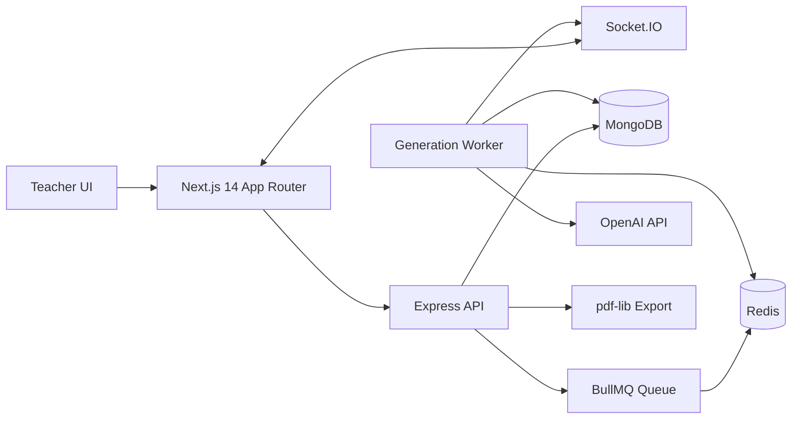

# VedaAI Assessment Creator

Production-quality AI assessment creator for teachers, built for a full-stack hiring assignment. The app follows the supplied Figma screens: desktop SaaS sidebar, mobile top/bottom navigation, assignment list and empty state, centered assignment creation form, live generation status, and a printable exam-paper output view.

## Architecture



## Monorepo Layout

```text
apps/web
  app/ components/ hooks/ lib/ services/ store/ types/
apps/server
  src/config controllers middleware models queues routes services sockets utils validators workers
```

## Features

- Assignment creation with React Hook Form, Zod validation, dynamic question type rows, and drag/drop upload.
- MongoDB assignment persistence with structured generated paper schemas.
- BullMQ generation queue backed by Redis with retries, concurrency, and progress updates.
- Dedicated AI pipeline: prompt builder, OpenAI service, strict JSON parser, and Zod validator.
- Socket.IO live progress events for queued, generating, parsing, completed, and failed states.
- Regeneration flow with history and real-time UI updates.
- Professional PDF export using `pdf-lib`, not `window.print()`.
- Polished responsive UI with TailwindCSS, shadcn-style local components, Zustand, Framer Motion, and toast feedback.

## Environment Variables

Create `apps/server/.env`:

```env
PORT=4000
MONGODB_URI=mongodb://localhost:27017/veda-ai
REDIS_URL=redis://localhost:6379
OPENAI_API_KEY=
CLIENT_URL=http://localhost:3000
```

Create `apps/web/.env`:

```env
NEXT_PUBLIC_API_URL=http://localhost:4000/api
NEXT_PUBLIC_SOCKET_URL=http://localhost:4000
```

If `OPENAI_API_KEY` is empty, the worker uses a deterministic local generator so the product flow still works for review.

## Setup

```bash
npm install
docker compose up -d mongodb redis
npm run dev
```

Open `http://localhost:3000`.

## Docker

```bash
cp apps/server/.env.example apps/server/.env
cp apps/web/.env.example apps/web/.env
docker compose up --build
```

## Cloud Deployment

This repository includes `vercel.json` for the Next.js app and `render.yaml` for the API.

Recommended hosted setup:

- Web: Vercel
- API: Render Docker web service
- MongoDB: MongoDB Atlas
- Redis: Upstash or Redis Cloud

Deploy API first so you know the production API URL. In Render, create a Blueprint from `render.yaml` or create a Docker web service manually with:

```text
Dockerfile path: apps/server/Dockerfile
Docker context: .
Health check path: /health
```

Set API env vars:

```env
NODE_ENV=production
PORT=4000
CLIENT_URL=https://your-vercel-app.vercel.app
MONGODB_URI=mongodb+srv://...
REDIS_URL=rediss://...
OPENAI_API_KEY=sk-...
```

Deploy web on Vercel with the root project directory and the included `vercel.json`. Set:

```env
NEXT_PUBLIC_API_URL=https://your-api.onrender.com/api
NEXT_PUBLIC_SOCKET_URL=https://your-api.onrender.com
```

After the Vercel URL is final, update `CLIENT_URL` in Render to that exact URL and redeploy the API.

## API Flow

1. `POST /api/assignments` accepts title, due date, instructions, question type JSON, and optional file.
2. API validates input, extracts text from PDF/text uploads, stores a queued assignment, and adds a BullMQ job.
3. Worker loads the assignment, builds a strict JSON prompt, calls AI, parses and validates the result, and stores structured output.
4. `GET /api/assignments/:id` returns the current assignment and generated paper.
5. `POST /api/assignments/:id/regenerate` queues another generation.
6. `GET /api/assignments/:id/export` streams a formatted PDF.

## WebSocket Flow

- Client connects to Socket.IO and subscribes with `assignment:subscribe`.
- Backend emits `assignment:progress` to the assignment room.
- Backend also emits `assignment:list:changed` so list cards update status during generation.

Progress payload:

```json
{
  "assignmentId": "string",
  "status": "queued",
  "progress": 5,
  "message": "Generation queued"
}
```

## Queue Architecture

BullMQ stores generation jobs in Redis. Jobs retry up to three times with exponential backoff. The worker runs at concurrency `4`, updates BullMQ progress, persists generation history to MongoDB, and emits socket events at each major stage.

## AI Pipeline

- `promptBuilder.ts` creates a strict JSON-only assessment prompt.
- `ai.service.ts` calls OpenAI with JSON mode and retries parsing failures.
- `parser.ts` extracts JSON safely and rejects invalid raw model output.
- `validator.ts` enforces the generated paper schema before anything is rendered.

The frontend only renders validated structured data from MongoDB.

## Screenshots

- Dashboard empty state: add screenshot here.
- Assignment list: add screenshot here.
- Upload/material selector: add screenshot here.
- Generated paper output: add screenshot here.

## Tradeoffs

- Auth is intentionally omitted to focus on the assessment creation workflow.
- PDF upload text extraction is capped to keep prompt size predictable.
- The local generator exists only as a review-friendly fallback when no AI key is configured.
- shadcn/ui components are implemented locally in the repository to keep the assignment self-contained.

## Future Improvements

- Add teacher authentication and school tenancy.
- Add richer PDF parsing and OCR for scanned worksheets.
- Store rubric and answer key separately from student-facing papers.
- Add template marketplace and per-class assignment analytics.
- Add automated tests around queue workers, parser failures, and PDF generation.
